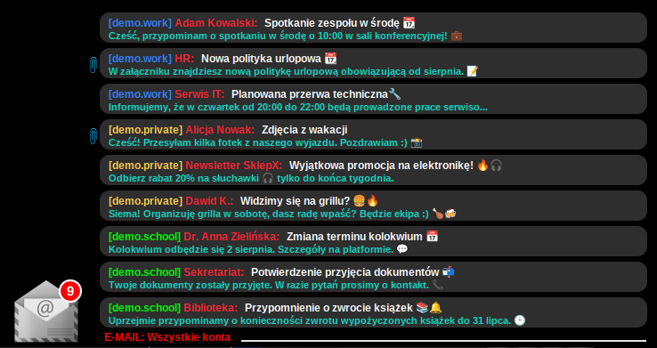
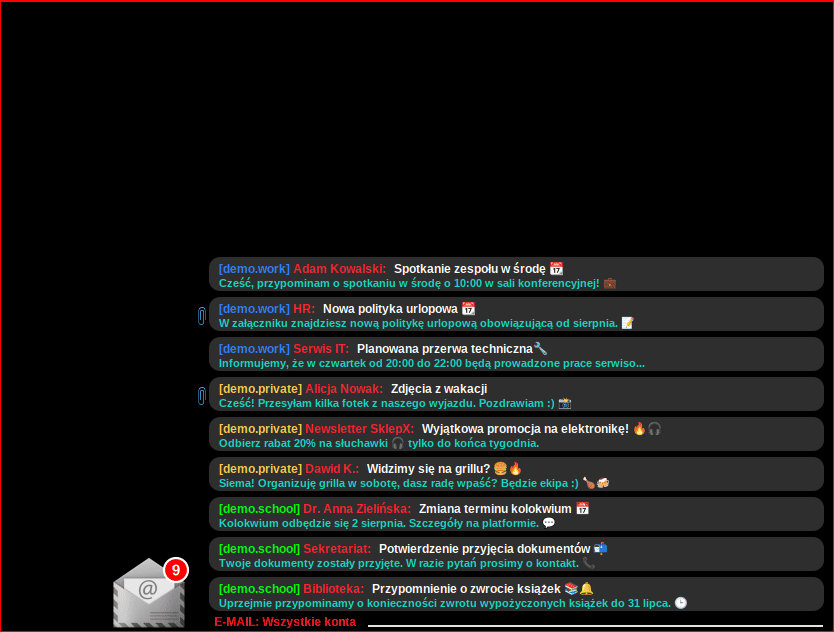

# Zupix_Py2Lua_Mail_conky

**Zupix_Py2Lua_Mail_conky** to hobbistyczny projekt widgetu powiadomień e-mail w conky, przeznaczony dla systemu GNU/Linux. Projekt powstał z myślą o wygodnym monitorowaniu wielu skrzynek pocztowych z poziomu pulpitu – bez potrzeby ciągłego otwierania klienta poczty.

---

## Opis projektu

Widget oparty jest o dwa uzupełniające się komponenty:

- **Backend (Python):**
    - Nawiązuje i utrzymuje stałe połączenia IMAP z wieloma kontami e-mail (możesz obsługiwać dowolną liczbę skrzynek).
    - Cyklicznie sprawdza nowe wiadomości bez każdorazowego logowania (natychmiastowa reakcja).
    - Przetwarza i zapisuje najważniejsze informacje o wiadomościach (nadawca, temat, fragment treści, data) w pliku cache (`JSON`), który czyta Lua.

- **Frontend (Lua/Cairo + Conky):**
    - Graficzny widżet na pulpicie z animacjami, ikonami, badge’ami i efektami graficznymi.
    - Dynamiczne przewijanie długich tematów/fragmentów, płynne zmiany przy przełączaniu kont.
    - Wsparcie dla niestandardowych ikon (PNG) i dźwięków powiadomień (WAV).
    - Wyświetlanie liczby nieprzeczytanych e-maili, szybkie przełączanie między kontami, wskaźniki błędów.

---

## Najważniejsze funkcje

- **Obsługa wielu kont IMAP** – nieograniczona liczba skrzynek, dowolni providerzy (np. Gmail, WP, Onet, o2, własny serwer).
- **Stałe, szybkie połączenie IMAP** – bez opóźnień, bez ciągłego logowania.
- **Konfigurowalne powiadomienia graficzn i dźwiękowe** – ikony, animacje, dźwięki + obsługa błedów jeśli brak plików.
- **Wyświetlanie meta-informacji** – ikona kopety z liczbą nieprzeczytanych wiadmości, fragmenty treści, nadawca (z obsługą polskich znaków i emotek).
- **Automatyzacja zmian za pomocą skrypty pomocniczych** – do instalacji zależności, podminay ścieżek w zmiennych, sprawdzania zgodności, startowania/resetowania widżetu, zmiany położenia okna conky i zmiany layoutu, masowego oznaczania wiadomości jako przeczytane/nieprzeczytane, itp.
- **Separator z nazwą konta** - Dynamiczny separator z nazwą aktualnie wyświetlanego konta + wyświetlaniem błędów logowania (lub brakiem interentu).
- **Obsługa kolorów dla nazw kont w RGB** - Indywidualne kolory dla poszczególnych nazw kont, aby widget był czytelniejszy w trybie multi-konta.
- **Wzkaźnik załączników** - Spinacz przy mailu sygnalizujący załącznik.
- **Obsługa błędów logowania** - Skrypt "python_mail_conky_lua.py" loguje błedy do tymczasowego pliku, gdzie lua pobiera tresć rysując stosowny komunikat w obrębie separatora.
- **Przewijanie długich treści** - Przewijanie długich treści. które nie mieszczą się w oknie conky. Jeśli się mieszczą, to nie przewijają się. (Można wyłączyć)
- **Manulane przewijanie listy maili** - Możliwość swobodnego przewiajnia listy z mailami za pomocą dwóch skryptów pomocniczych "mail_down.sh" oraz "mail_up.sh", które dla wygodny najlepiej podpiąć pod skrót klawiszowy.
- **Płynne przełączanie kont** - Dynamiczne przełączanie załadowanych kont, na podstawie indywidualnych indeków (skrypt Zmień_konto.sh)
- **Wiele wbudowanych ustawieniń layoutu** - Zależnie do opcji "up, down, up_left, up_right, down_left, down_right" dopasowanie pozycji widgetu na pulpicie do preferencji użytkownika. Automatyczna zmiana za pomocą skryptu "Zmiana_pozycji_okna_conky_v3.sh".

---

## Jak to działa?

1. **Skrypt Python** (`py/python_mail_conky_lua.py`) działa w tle – nawiązuje połączenia IMAP, odpytuje konta i aktualizuje plik cache.
2. **Skrypt Lua** (`lua/e-mail.lua`) uruchamiany przez Conky – pobiera dane z pliku cache i renderuje powiadomienia na pulpicie.
3. **Dodatki:** Ikony, dźwięki oraz konfiguracje są w podfolderach. Skrypty bash automatyzują instalację, uruchamianie, resetowanie.

## Instalacja i wymagania

1. **Linux z Conky** (zalecane: 1.12+ z obsługą Lua/Cairo).
2. **Python 3** (moduły: imaplib, email, json – standardowe).
3. **Lua 5.1+**
4. **Zenity oraz notify-send** (dla powiadomień i skryptów).

Konfiguracja i uruchomienie:

1.    Edytuj ./config/accounts.json – wpisz swoje konta e-mail (gotowy szablon, wprowadz tylko dane logowania).

2.    Edytuj ./lua/e-mail.lua - w bloku "ACCOUNT_COLORS =" wpisz w tej samej kolejności nazwy kont, które wprowadziłeś w pliku "accounts.json" ("name") oraz w bloku "local ACCOUNT_NAMES =" wpisz pełne nazwy kont do wyświetlania przy separatorze. (również w takiej samej kolejności)

3.    Uruchom skrypt "1.Instalacja_zależności+tryb_awaryjny.sh". Po pomyślnej instalacji zaproponuje uruchomienie kolejnego skrypty "2.Podmiana_wartości_w_zmiennych.sh", który ustawi odpowiednie ściezki dla zmiennych i zaproponuje uruchomienie ostatniego skryptu "3.START_skryptu_oraz_conky.sh", który uruchomi skrypt "python_mail_conky_lua.py" oraz "conkyrc_mail".

4. Gotowe – widżet powinien pojawić się na pulpicie :)
